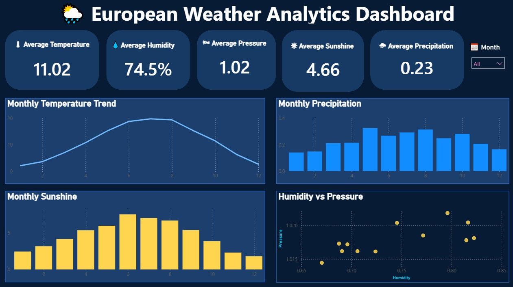

# 🌦 European Weather Analytics Dashboard | Power BI

An interactive **Power BI dashboard** built to analyze European weather patterns using historical weather data. This dashboard provides insights into temperature, humidity, pressure, sunshine, and precipitation through interactive visualizations and KPI cards.

---

## 📸 Dashboard Preview

> Replace the image below with your uploaded screenshot.



---

## 🚀 Features

- 📊 Interactive KPI Cards
- 🌡 Monthly Temperature Trend Analysis
- 🌧 Monthly Precipitation Analysis
- ☀ Monthly Sunshine Analysis
- 💧 Humidity vs Pressure Correlation
- 📅 Month Slicer for Interactive Filtering
- 🎨 Professional Dark Theme Dashboard

---

## 📈 Key Insights

- Average temperature peaks during the summer months.
- Sunshine hours increase significantly in warmer seasons.
- Precipitation varies across different months.
- Humidity and pressure exhibit a weak correlation.
- Interactive filtering allows monthly weather exploration.

---

## 🛠 Tools & Technologies

- Microsoft Power BI
- Power Query
- DAX
- Data Visualization
- CSV Dataset

---

## 📂 Project Structure

```
📁 European-Weather-Analytics-Dashboard
│
├── README.md
├── dashboard.png
├── European_Weather_Analytics_Dashboard.pbix
└── European Weather Prediction Dataset (Zenodo)
```

---

## 📊 Dashboard Components

### KPI Cards
- Average Temperature
- Average Humidity
- Average Pressure
- Average Sunshine
- Average Precipitation

### Visualizations
- Line Chart – Monthly Temperature Trend
- Column Chart – Monthly Precipitation
- Column Chart – Monthly Sunshine
- Scatter Plot – Humidity vs Pressure

### Filters
- Month Slicer

---

## 🎯 Skills Demonstrated

- Data Cleaning
- Data Transformation
- Dashboard Design
- Data Visualization
- KPI Reporting
- Interactive Dashboard Development
- Power BI
- Power Query
- DAX

---

## 👨‍💻 Author

**Atul Kumar Anupam**

- LinkedIn: https://www.linkedin.com/in/atul-kumar-anupam/
- GitHub: https://github.com/iamatulcs

---

⭐ If you like this project, consider giving it a star!
